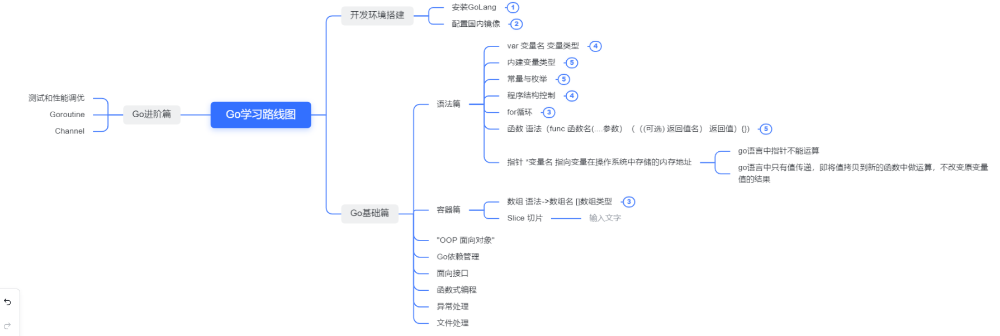

# Go-learn
根据慕课网重新初学Go语言[Google资深工程师深度讲解go语言，由浅入深掌握](https://coding.imooc.com/learn/list/180.html)
此仓库记录Go基础、进阶等学习代码

# 安装部署
1. 登录go官方网站 [GoLang](https://golang.google.cn/) 根据操作系统安装下载对应的安装包
2. 安装golang 
3. 打开命令行 输入 go verison 出现如下内容代表安装成功
   
   
   
4. 配置国内代理GOPROXY： go env -w GOPROXY=http://goproxy.cn 
5. 配置GO111MODEL： go env -w GO111MODEL=on

# 学习路线
个人暂时整理的学习路线 会不断更新内容


# 基础篇

## 语法篇
> 1. 变量（var）
> 2. GO语言的内建变量类型
> 3. 常量与枚举（const）
> 4. 程序结构控制（switch、if）
> 5. 循环（for）
> 6. 函数（func）
> 7. 指针（pointer）

### 变量(var)

> var 变量名 变量类型  例： var name string

在Go中变量使用关键字 var 进行修饰 。与Java不同的是变量类型放置在最后，变量名放置在中间。
在Go中的变量在定义时，若未同时对变量进行赋初值，会给变量提供一个初值，若变量类型是int型则初值为0.
若变量类型是string则初值为""

```go
package main

import "fmt"

func main() {
   var age int
   var name string
   fmt.Println(age,name)
}
```
> 0 

为变量赋初值的方法是在声明变量时即可对变量赋初值
```go

package main

import "fmt"

func main() {
   var age int
   var name string
   //赋值的第一种方法
    age = 18
    name = "tsqqqqq"
    //定义变量时 不定义数据类型 go语言的类型推断会自动帮我们判断当前变量的类型
    var check = true
   fmt.Println(age, name,check)
}
```
> 18 tsqqqqqq true
> 
上述我们看到两种对类型赋初值的方法，第一种为先声明变量，再将变量赋初值。第二种为借由GoLang中的类型推断来对推断变量的类型从而把值赋给变量。

来让我们康康go语言中对变量的声明和赋初值的简易操作。
```go
package main

import "fmt"

func main() {
   age,name,check :=18,"tsqqqqqq",true
   fmt.Println(age, name,check)
}
```
> 18 tsqqqqqq true

上述例子也同样展现了go语言中的一个特性。支持多变量同时赋值。牛吧！！！不过特殊的 这样的语法糖仅可以在<font color="red">函数内</font>使用

在go语言中 没有<font color="red">全局变量</font>，最大的作用域是局限于同一个包范围下单的变量。只需要在包内对变量进行声明，所有同一个<font color="red">package下的go文件</font>都可以使用该变量
也可以认为是一个近似于全局变量的对象。

如果我们需要一次性定义很多变量，而我们又不想写太多的代码的话，可以使用var()集中定义变量的形式来对变量进行定义。
```go
package main

import "fmt"
var(
	age = 18
	name = "tsqqqqqq"
	check = true
)
func main() {
   fmt.Println(age, name,check)
}
```
> 18 tsqqqqqq true

## Go语言基础的内建类型
> bool string
> 
> (u)int (u)int8 (u)int16 (u)int32 (u)int64 uintptr
> 
> byte rune
> 
> float32 flot64 complex64 complex128

在Go语言中包含了以上列举的内建数据类型
其中 int类型由1字节-64字节 其中int8代表的就是一个byte，在而uint代表无符号整型。
uintptr 代表整型类型的指针。其中整型的取值范围分别如下图表示


bool 与 string 还有 byte 都是我们的老homie了 ，bool仅包含两个值 true or false，string代表字符串类型。byte代表字节类型
float32 与 float64 分别等价于c语言中的double与float 是我们认识的浮点类型。

complex64 其实是由两个float32组成的，代表32位计算机的复数类型
同理 complex128 是由两个float64组成的，代表64位计算机的复数类型

哦豁 有新朋友 rune 其实就是字符类型 代表单个Unicode字符 在go语言中的定义它 rune int32 用来处理utf-8的unicode字符

重点为，go语言中不存在隐式的类型转换，若需要对类型进行转换必须使用强制类型转换
> 类型(需要转换的类型) int(float)
## 常量与枚举
> const 常量名 常量类型 例 const pi float64

有变量就自然有常量，在go语言中，常量的定义和使用与变量基本无差。只需要注意的是，定义了常量之后我们无法再去对这个常量的值进行改变。
默认为java中被final修饰过的值.

在go语言中将枚举分为两种枚举
1. 自定义枚举：指的是在const()集中定义的常量块内进行自定义的操作
2. 自增枚举：在定义枚举的时候使用iota关键字，可以对修饰的常量赋值为1 而他之后的枚举类型会自增1

```go
package main
/**
自定义枚举类型
*/
const (
	cpp    = "cpp"
	java   = "java"
	python = "python"
)
/**
自增枚举
 */
const (
   b = 1 << (10 * iota)
   kb
   mb
   gb
   tb
   pb
)
```
## 程序结构控制(switch,if)
> switch { ...case :} or switch check {...case}

直接上代码举例说明

```go
package main

import "fmt"

const (
   add = "+"
   sub = "-"
   mul = "*"
   div = "/"
)

func operation(op string, a, b int) (res int) {
   switch op {
   case add:
      res = a + b
   case sub:
      res = a - b
   case mul:
      res = a * b
   case div:
      res = a / b
   default:
      panic("不存在该操作符")
   }
   return
}
func main() {
   res := operation(add, 3, 4)
   fmt.Println(res)
}
```
Go语言中的switch条件判断可以在switch关键字后使用也可以在case中进行判断。在Go语言中 case无需使用break来退出，除非使用fallthrough。

> if check {} 

if 的语法也非常简单，它无需判断条件外部添加括号，毕竟go语言一切以简单为主。
上代码！

```go
package main

import (
   "fmt"
   "io/ioutil"
)

func main() {
   const filename = "abc.txt"
   contexts, err := ioutil.ReadFile(filename)
   if err != nil {
      panic(err)
   }
   fmt.Printf("%s\n", contexts)
}
```
特殊的是 go语言中的if语句条件判断时可以赋值，而那个在if语句条件判断时赋值的变量，作用域仅在该if代码块中。其他代码块无法引用该变量。
```go
package main

import "fmt"

func main() {
   if i := 17; i >= 18 {
      fmt.Println("成年人")
   }else{
   	  fmt.Println("未成年,年龄为：",i)
   }
}
```
## 循环(for)
在go语言中，没有while循环，因为go语言的设计是为了简便，而for关键字的操作完全可以把while、do-while替换掉
让我们分别来看看三种for循环的范例：

```go
package main

import (
   "fmt"
   "strconv"
)

func f1(str string) {
   for v:=range str{
   	    fmt.Println(v)
   }
}
func f2(N int) {
   for N > 0 {
      fmt.Println(2 * N)
      N -= 1
   }
}
func f3(N int) string {
   res := ""
   for ; N > 0; N /= 2 {
      N %= 2
      res = strconv.Itoa(N) + res
   }
   return res
}
func main() {
   f1("tsqqqqqq")
   f2(10)
   fmt.Println(f3(256))
}
```
以上是常见的三种for循环的使用方式：
1. f1中的循环使用了一个关键字 range，是Go语言提供的，类似与foreach的循环方式,可以对数组,字符串(字符串底层是[]byte),slice(切片),map进行遍历
2. f2中的循环我们可以看到，他就是while麻，只不过使用了for关键字而已。这下我们知道了go语言中对简单开发的理解是多么的深刻
3. f3中也是我们常见的循环结构，值，循环次数和离开条件，循环规则。
